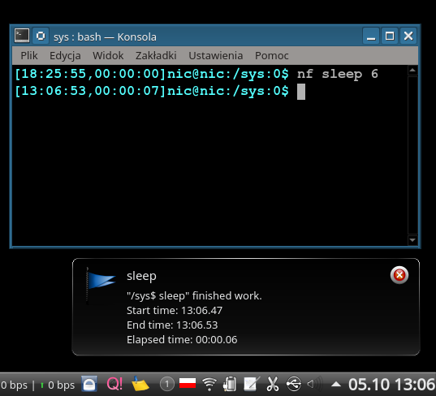
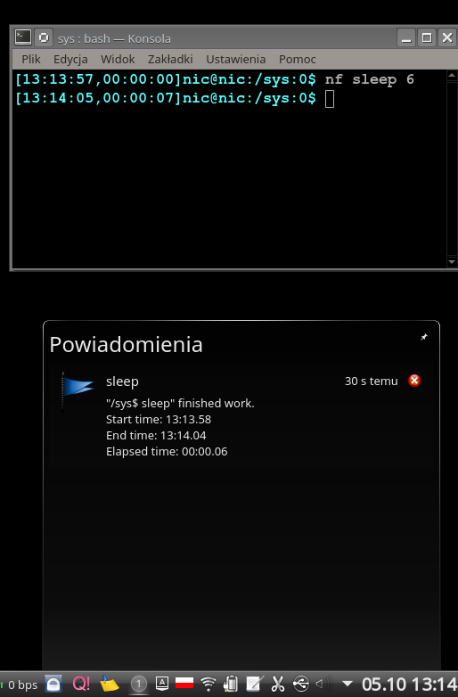
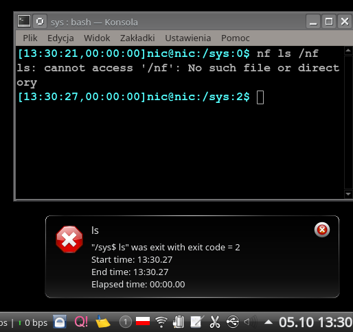
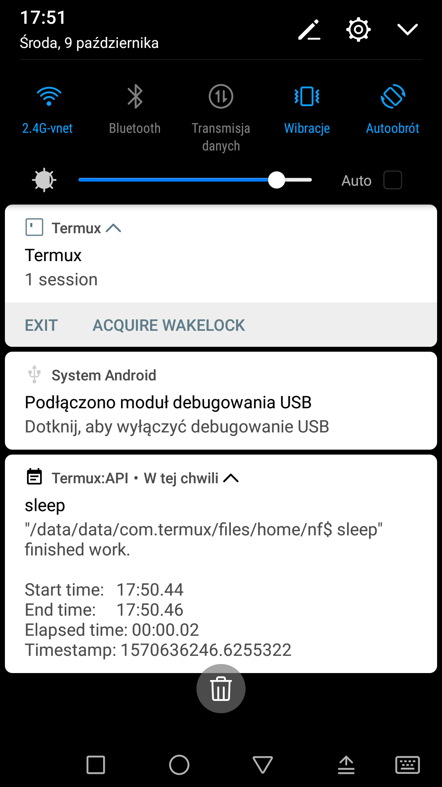

==============
nf
==============

IN SHORT
--------

``nf`` is a tool to make notification for user that its command finish work. For example "make" program that takes long time to finish.

SPDX-License-Identifier: 0BSD

Project name: jsonfromschema
License: 0BSD / Free Public License 1.0.0
More information about license: https://opensource.org/licenses/0BSD

SCREENSHOTS
-----------

1. Screenshot from KDE:

2. Screenshot from KDE:

3. Screenshot from KDE:

4. Screenshot from Android:

NON-INSTALL
-----------

.. code-block:: bash

    git clone git@github.com:NIC-MichalLabedzki/nf.git

You can run it from sources without any dependancies* (python and some modules delivered with it)

.. code-block:: bash

    python ./nf.py

See:

.. code-block:: bash

    python ./nf.py --help

See CLI section for more details.

INSTALLATION
------------

.. code-block:: bash

    pip install nf

or

.. code-block:: bash

    pip install -e git@github.com:NIC-MichalLabedzki/nf.git

or

.. code-block:: bash

    pip install -e https://github.com/NIC-MichalLabedzki/nf.git

or

.. code-block:: bash

    git clone git@github.com:NIC-MichalLabedzki/nf.git
    cd nf
    python setup.py # or pip install -e .

INTERFACE
---------

There are one kind of interfaces: ``CLI``.

If you think there is a need to have ``lib``/``module`` to please let me know why.
Maybe there is a reason.

CLI
~~~

CLI is Command Line Interface. So you have tool called: nf

.. code-block:: bash

    $ python nf.py --help
    usage: nf.py [-h] [-l LABEL] [-p] [-n] cmd ...

    Simple command line tool to make notification after target program finished work

    positional arguments:
    cmd
    args

    optional arguments:
    -h, --help            show this help message and exit
    -l LABEL, --label LABEL
                            Add humn readable text to custom job identification
    -p, --print           Print notification text in stdout too
    -n, --no-notify       Do not do annoying notifications
    -s, --save            Save/append command and stat to .nf file

    Examples:
    nf make
    nf ls
    nf ls not_exist_file
    nf sleep 2
    nf -l sleeping sleep 2
    nf -l `tty` ls
    nf "ls | grep .py"

    "/home/nf/src/nf$ nf.py -p ls
    LICENSE  nf.py  pytest.ini  README  README.dev  requirements-dev.txt  setup.cfg  setup.py  tox.ini
    -----------------------------------------------------------
    "/home/nf/src/nf$ ls" finished work.

    Start time:   17:32.50
    End time:     17:32.50
    Elapsed time: 00:00.00
    -----------------------------------------------------------

LIMITATIONS
-----------
1. Work with Jython: it does not have dbus module, fallback to command line.
2. Observed in KDE: notification with the same body (text) can be dropped. To avoid that I add timestamp text to make nofitications unique.

FEATURES
--------
1. Support Android notification by termux-notifications (of course by `termux`)
2. Support dbus by python module or fallback to `notify-send` (part of `libnotify` 0.7.7 or 0.7.8)
3. Option to print notification on stdout.
4. Option to save full command line and stat to file into working directory.
5. Support whole python implementations/versions (at least not crash and print on stdout)

TODO
----
1. Test Windows support
